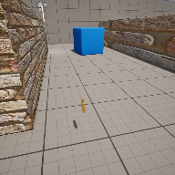

# Project Name  COMP1116-7

## Description

A github repository for the in class demonstration code, week 7. Load and Save game functionality added with Save Game object as well as persisting score across levels with Game Instance object.   
 
## Usage
Clone, or download the zip, to a local directory. Open in Unreal Engine 5.4 or newer

## Attributions

1) Coin sound, 8-bit platformer SFX, ( https://opengameart.org/content/8-bit-platformer-sfx ) 
2) Low poly tree, openGameArt, ( https://opengameart.org/content/low-poly-tree-1 ) 
3) UI Adventure Pack, Button images, Kenney.nl, ( https://kenney.nl/assets/ui-pack-adventure ) 
4) UI arrow, OnScreen Controls, Kenney.nl, ( https://kenney.nl/assets/onscreen-controls ) 
5) Kinder Egg, Javidan on TurboSquid, ( https://www.turbosquid.com/3d-models/chocolate-gift-2236973 ) 

